# Analisis Mutu Air Sungai di Indonesia

## 📘 Latar Belakang Proyek
Air merupakan sumber daya alam yang sangat vital bagi kehidupan manusia, baik untuk kebutuhan domestik, pertanian, industri, hingga ekosistem alamiah. Namun, peningkatan aktivitas manusia seperti urbanisasi, industri, dan pertanian yang tidak terkontrol telah menyebabkan degradasi kualitas air, terutama pada badan-badan air seperti sungai.

Indonesia sebagai negara kepulauan memiliki banyak sungai yang tersebar di berbagai provinsi dan berperan penting sebagai sumber air utama bagi masyarakat. Meskipun demikian, pencemaran sungai masih menjadi permasalahan serius, terutama di daerah padat penduduk dan kawasan industri. Laporan dari berbagai lembaga lingkungan menunjukkan bahwa banyak sungai mengalami penurunan mutu air dari tahun ke tahun akibat limbah domestik, limbah industri, dan sedimentasi.

Dalam konteks ini, analisis data historis mutu air sungai menjadi sangat penting untuk:
1. Memantau tren pencemaran secara berkala,
2. Mengidentifikasi sungai-sungai yang mengalami penurunan kualitas secara signifikan,
3. Memberikan dasar bagi pengambilan keputusan berbasis data oleh pemerintah, LSM, dan masyarakat,
4. Meningkatkan kesadaran publik terhadap pentingnya menjaga kualitas air.

## 🧭 Tujuan Proyek
Proyek ini bertujuan untuk:
<li> Melakukan cleansing dan transformasi data mutu air sungai tahunan di Indonesia.
<li> Menyusun klasifikasi mutu air berdasarkan skor numerik dengan kategori Baik, Sedang, dan Buruk.
<li> Menyajikan visualisasi tren mutu air per provinsi dan per sungai dalam bentuk grafik garis.
<li> Membangun struktur data berbasis dictionary untuk kemudahan analisis dan plotting terstruktur.

## 🔎 Metodologi
### 🔹Sumber Data
Data berasal dari file `status_mutu_air.csv`[^1] yang memuat informasi nama provinsi, nama sungai, dan status mutu air dari tahun 2017 hingga 2022.

### 🔹Data Cleansing
<li> Mengisi nilai kosong (NaN) menggunakan forward-fill (ffill) dan backward-fill (bfill) secara horizontal (per baris).
<li> Menormalkan nilai kategori dengan menghapus spasi dan mengubah huruf ke lowercase agar seragam.

### 🔹Klasifikasi Mutu Air
Kategori mutu air seperti “Cemar Ringan”, “Cemar Sedang”, dan “Cemar Berat” dikonversi ke bentuk numerik:
<li> Baik: 0–10
<li> Sedang: 11–29
<li> Buruk: ≥30

Notes : Kategori mutu air didasarkan pada PP No. 82 Tahun 2021[^2], untuk penentuan status mutu air berdasarkan US-EPA[^3]

### 🔹Struktur Data
1. Data diubah menjadi nested dictionary `mutu_dict` dengan struktur provinsi -> sungai -> list mutu per tahun.
2. Dictionary tambahan `sungai_dict` dibuat untuk analisis per sungai secara individual.

### 🔹Visualisasi
<li> Plot per provinsi menampilkan semua sungai dalam provinsi tersebut.

<li> Plot per sungai menampilkan tren mutu air tiap sungai dari tahun ke tahun.

<li> Background visual dibagi dalam tiga zona warna: hijau (baik), kuning (sedang), merah muda (buruk).

## 💡 Hasil
1. Beberapa sungai menunjukkan tren peningkatan mutu air dalam kurun waktu 2017–2022, diantaranya:
    <ul>
    <li> Asahan (SUMATERA UTARA)

    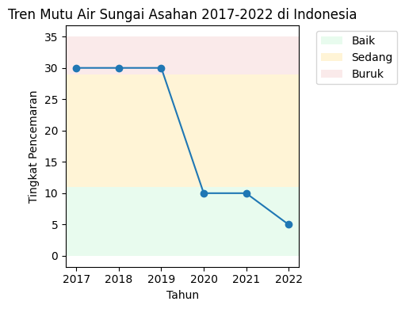
    <li> Cisadane (JAWA BARAT)
    
    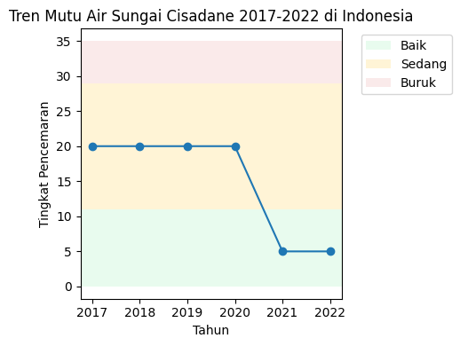
    <li> Aesesa (NUSA TENGGARA TIMUR)
    
    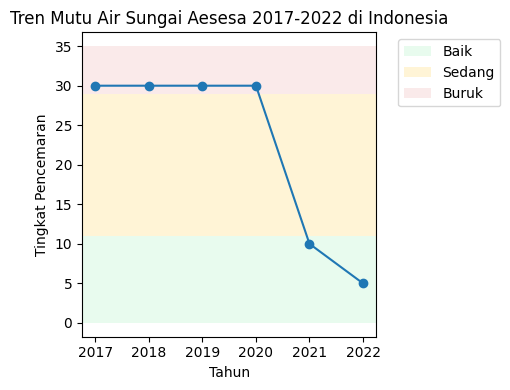
    <li> Citanduy (JAWA BARAT)
    
    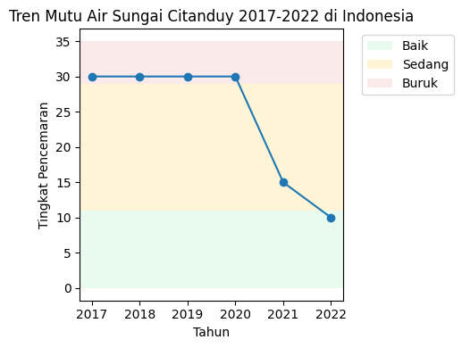
    <li> Baturusa (KEPULAUAN BANGKA BELITUNG)
    
    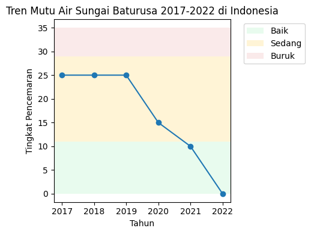
</ul>

2. Beberapa sungai menunjukkan tren penurunan mutu air dalam kurun waktu 2017–2022, diantaranya:
    <ul>
    <li> Babak (NUSA TENGGARA BARAT)
    
    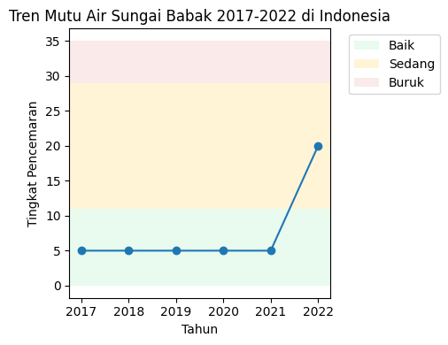
    <li> Batang Kampar (SUMATERA BARAT)
    
    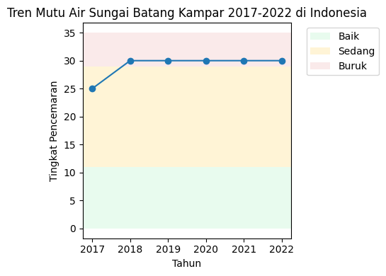
    <li> Brangbiji (NUSA TENGGARA BARAT)
    
    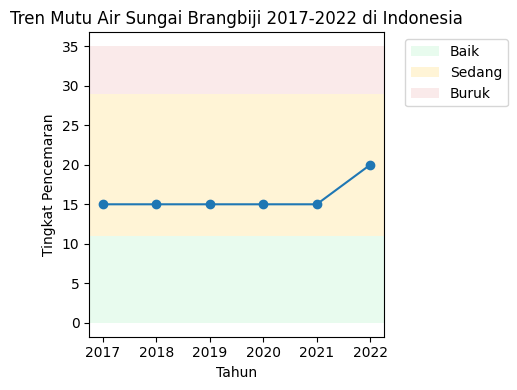
    <li> Muka Kuning (KEPULAUAN RIAU)

    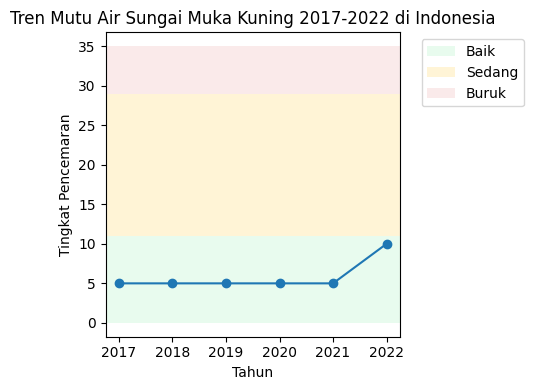
    <li> Outlet Danau Semayang (KALIMANTAN TIMUR)

    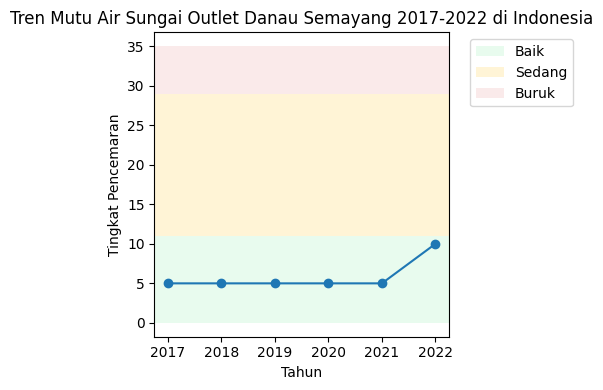
</ul>

3. Provinsi dengan jumlah sungai tercemar sedang hingga berat lebih banyak yaitu:
    <ul>
    <li> NUSA TENGGARA BARAT

    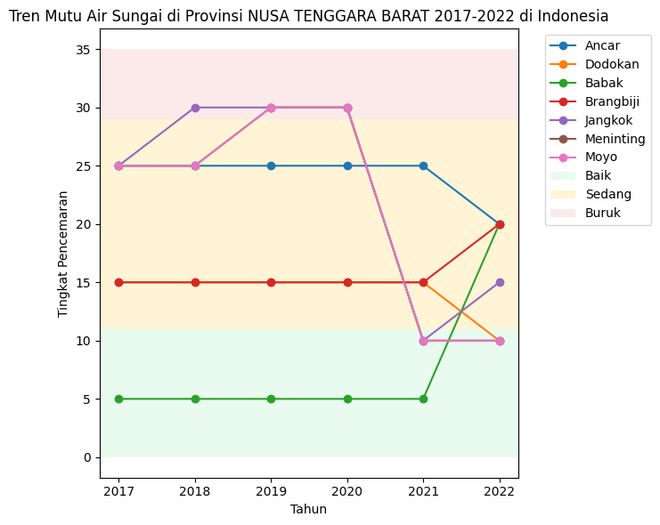
    <li> MALUKU

    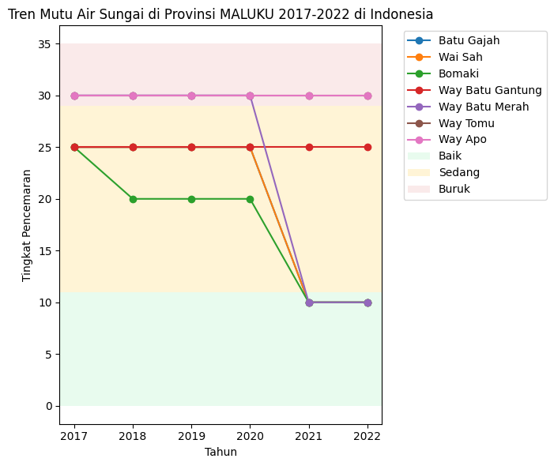
    <li> RIAU

    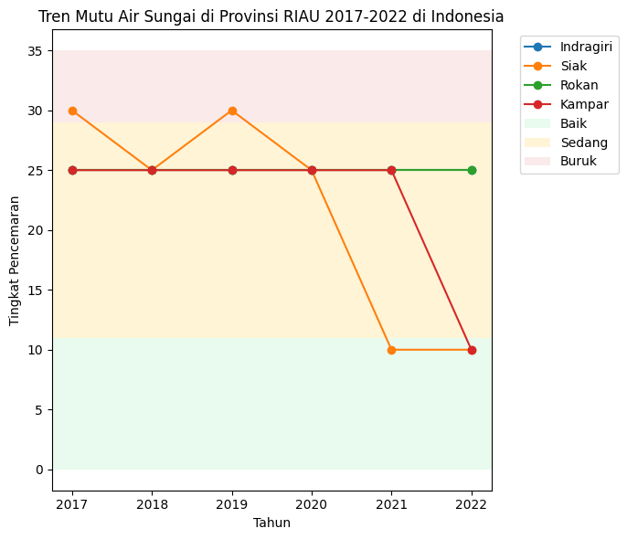
</ul>

Untuk proses dan hasil visualisasi dari notebook dapat dilihat pada file berikut:  
[analisis_mutu_air_sungai.ipynb](analisis_mutu_air_sungai.ipynb)

## 📄 Saran dan Kesimpulan
Berdasarkan hasil dari analisa yang kami lakukan, berikut beberapa saran yang kami ajukan:
<li> Sebagian data masih rancu dalam pengklasifikasian dan pemberian bobot nya, sebagai contoh ada kategori cemar ringan- cemar berat yang membuat kami ragu dalam memberikan bobot nya, harapannya ada perapihan standar pengklasifikasian serta penentuan bobot nya agar hasil yang didapat lebih baik,
<li> Untuk sungai yang punya tren penurunan kualitas agar dapat diberi perhatian lebih, bisa berupa inspeksi akar masalah yang memperparah kondisi sungai tersebut, selain itu juga bisa menjadi acuan untuk membuat program clean up sungai di wilayah masing-masing,
<li> Untuk sungai yang punya tren kenaikan kualitas mutu air agar bisa diberikan reward atau penghargaan kepada wilayah tersebut sehingga dapat memberikan motivasi agar setiap wilayah berlomba-lomba memperbaiki kualitas mutu air sungai nya. 

Dengan integrasi analitik lanjutan seperti clustering atau prediksi tren, proyek ini dapat dikembangkan lebih lanjut menjadi sistem peringatan dini (early warning system) atau dashboard pemantauan mutu air sungai nasional.

---
[^1]: [SISLHK: Data Status Mutu Air](https://statistik.menlhk.go.id/sisklhkX/data_statistik/ppkl/table5_18)  
[^2]: [PP No. 82 Tahun 2001](https://peraturan.bpk.go.id/Details/53103/pp-no-82-tahun-2001)  
[^3]: [Penilaian Status Mutu Air](https://www.scribd.com/document/486899916/4-Penilaian-Status-Mutu-Air)